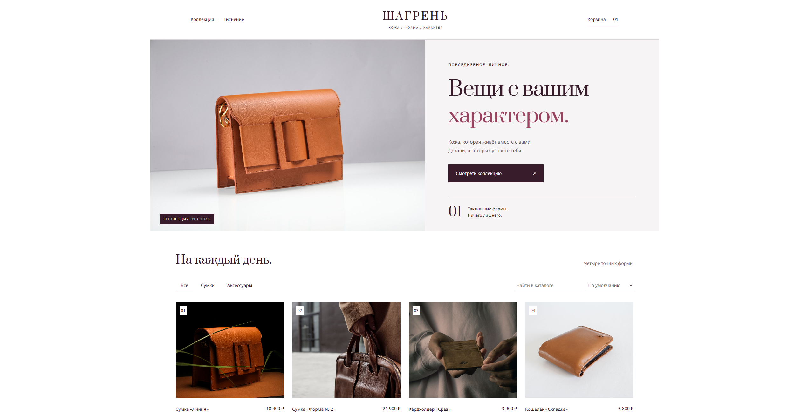
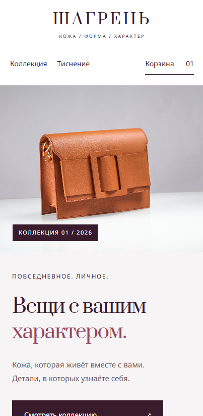

# Шагрень

Интернет-магазин изделий из кожи с минималистичным интерфейсом и спокойной визуальной подачей.

Проект сделан как самостоятельный портфолио-кейс: от структуры страниц и адаптивного интерфейса до production-сборки и публикации.

**Демо:** [shagreen.vercel.app](https://shagreen.vercel.app/)

## О проекте

«Шагрень» — концепт интернет-магазина кожаных изделий.

В дизайне хотелось уйти от типичного шаблона магазина с большим количеством баннеров, ярких акцентов и перегруженных карточек. Поэтому интерфейс построен вокруг продукта: крупные изображения, сдержанная типографика, много свободного пространства и простая навигация.

Отдельное внимание уделено адаптивности и общей целостности интерфейса на разных размерах экрана.

## Превью





## Возможности

- каталог кожаных изделий;
- карточки товаров;
- корзина;
- адаптивный интерфейс;
- навигация по разделам магазина;
- единая дизайн-система;
- корректная работа на десктопе и мобильных устройствах.

## Технологии

- React
- TypeScript
- Node.js
- esbuild
- CSS
- SQLite

## Локальный запуск

Клонировать репозиторий:

```bash
git clone https://github.com/wakukiku/shagreen.git
cd shagreen
```

Установить зависимости:

```bash
npm install
```

Запустить проект в режиме разработки:

```bash
npm run dev
```

## Production-сборка

Собрать проект:

```bash
npm run build
```

Запустить собранную версию:

```bash
npm start
```

## Проверка проекта

Проверка TypeScript:

```bash
npm run check
```

Запуск тестов:

```bash
npm test
```

## Деплой

Проект опубликован на Vercel.

После изменений в основной ветке новая версия проекта автоматически собирается и публикуется.

[Открыть живую версию →](https://shagreen.vercel.app/)

---

Проект создан как часть моего портфолио веб-разработки.
